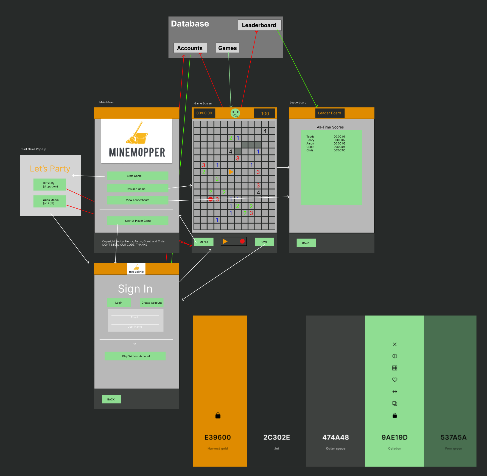

# MineMopper

A playable minesweeper based game application that for mobile devices using react-native 

This project was bootstrapped with [Create Expo App](https://docs.expo.dev/tutorial/create-your-first-app/).



[Link to Figma](https://www.figma.com/file/WPkAtbhns2LfGyGIO7Amr3/Main-App?type=design&node-id=0%3A1&mode=design&t=wa3YySYS0Ic4YJdG-1)


#### By Christopher Davila, Aaron Mejia, Henry Oberholtzer, Grant Abe, Teddy Peterschmidt

## Technologies Used

* 💣  _JSX: (see React for verson)_
* ⏰  _Node.js 20_
* 💣 _Javascript: v ES13_
* 🚩 _Html5_
* 💣 _CSS: W3 4.15_
* 💥 _Expo/webpack config: v 19.0.0_
* 💣 _React-navigation/native": v6.1.9_
* 🚩 _React-navigation/native-stack: v 6.9.17_
* 💣 _React-navigation/native-stack: v ^6.9.17_
* ⌛ _types/react: v ~18.2.14_
* 💣 _Expo: v ~49.0.15_
* 🚩 _Expo-status-bar: v ~1.6.0_
* 💣 _Firebase: v 9.23.0_
* 💥 _React: v 18.2.0_
* 💣 _React-dom: v 18.2.0_
* 🚩 _React-native: v 0.72.6_
* 💣 _React-native-safe-area-context: v 4.6.3_
* ⏰ _React-native-screens: v ~3.22.0_
* 💣 _React-native-web: v ~0.19.6_
* 🏆 _Typescript: v 5.1.3_
* 💣 _Figma_


## Description
* This is a playable phone application for android, IOS and via browser of the classic Microsoft game minesweeper in the style of minemopper.  Register (or if already have an account registered please sign in with your credentials) to access game play. The intention of the game is to uncover all tiles without clicking ona bomb. Click on any of the tiles to begin, a blank space confirms that no surrounding tiles have a bomb, a number will tell you how many of the tiles surrounding said number have incindiary devices attached.  A timer is started on first tile click that player must compete with to complete the level. Difficulty setting may be adjusted for amount of bombs and tiles. Player may save there current game and high score to return at later time.  To view the scoreboard click option in menu. This app was built using Typescript for back-end and react-native library on front end

## Setup/Installation Requirements

* 1. Clone this repo using `\$ git clone https://github.com/mejia-dev/minemopper`.
* 2. Open your terminal (e.g., Terminal or GitBash) and navigate to the correct (root)directory using `\$ cd minemopper` and run `\$ npm i` to download all the package dependencies.
* 3. Go to [firebase](https://console.firebase.google) to create your own free Firebase account in order to obtain your own database if recreating project
* 4. create a .env file in the root folder and save your private keys and other info into variables that begins with 'EXPO_APP_' and proceeded by whatever name desired like so...

```txt
  EXPO_PUBLIC_FIREBASE_API_KEY={YOUR API KEY}
EXPO_PUBLIC_FIREBASE_AUTH_DOMAIN={YOUR AUTH DOMAIN}
EXPO_PUBLIC_FIREBASE_PROJECT_ID={YOUR PROJECT}
EXPO_PUBLIC_FIREBASE_STORAGE_BUCKET={YOUR STORAGE BUCKET}
EXPO_PUBLIC_FIREBASE_SENDER_ID={YOUR SENDER ID}
EXPO_PUBLIC_FIREBASE_APP_ID={YOUR APP ID}
```
 It may be easiest to use the variables already being used in the project, just remove the process.env. when setting up the variables in the .env file.
* 5. Next run `\$ npx expo start` to deploy a server. A list of optons to run the server will pop up in the terminal along with a QR scancode that you can scan with your mobile device of choice to run the application on your phone


## Available Scripts

In the project directory, you can run:

### `expo start`

Runs the app in the development mode.\
Open [http://localhost:3000](http://localhost:3000) to view it in your browser.

The page will reload when you make changes.\
You may also see any lint errors in the console.

### `expo start --android`

Runs the app in the development mode for android device.\
Once you run start, scan the QR code that pops up in the terminal.

The page will reload when you make changes.\
You may also see any lint errors in the console.

### `expo start --ios`

Runs the app in the development mode for ios device.\
Once you run start, scan the QR code that pops up in the terminal.

The page will reload when you make changes.\
You may also see any lint errors in the console.


### `expo start --web`

Runs the app in the development mode on a web browser.\
Open [http://localhost:3000](http://localhost:3000) to view it in your browser.

The page will reload when you make changes.\
You may also see any lint errors in the console.


### `npm run eject`

**Note: this is a one-way operation. Once you `eject`, you can't go back!**

If you aren't satisfied with the build tool and configuration choices, you can `eject` at any time. This command will remove the single build dependency from your project.

Instead, it will copy all the configuration files and the transitive dependencies (webpack, Babel, ESLint, etc) right into your project so you have full control over them. All of the commands except `eject` will still work, but they will point to the copied scripts so you can tweak them. At this point you're on your own.

You don't have to ever use `eject`. The curated feature set is suitable for small and middle deployments, and you shouldn't feel obligated to use this feature. However we understand that this tool wouldn't be useful if you couldn't customize it when you are ready for it.


### Making a Progressive Web App

This section has moved here: [https://facebook.github.io/create-react-app/docs/making-a-progressive-web-app](https://facebook.github.io/create-react-app/docs/making-a-progressive-web-app)

## Known Bugs

* _No known bugs as of yet_

## License
[MIT](https://github.com/mejia-dev/react-section-portfolio/blob/main/License.txt)

